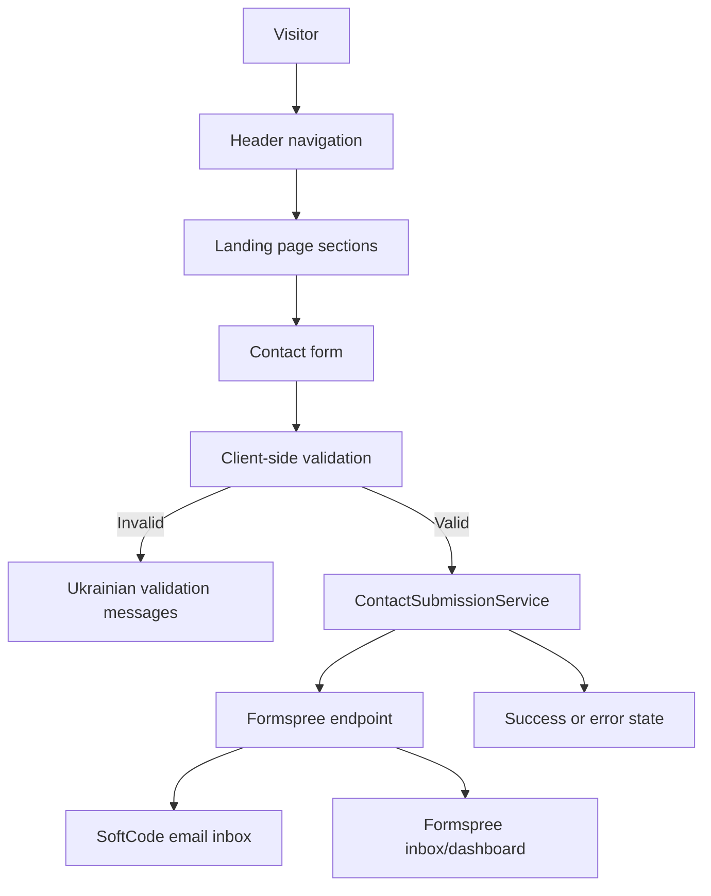

# SoftCode Landing Page Low-Level Design

## 1. Document Purpose

This document defines the low-level design for the first release of the SoftCode landing page.
It refines the high-level design from `HLD.md` into practical implementation decisions for the Angular web application, its page sections, internal structure, contact form behavior, and deployment approach.

The LLD is intentionally not a full technical specification for every small UI element. It describes the main application parts, their responsibilities, and how they interact so the first version can be implemented consistently without overengineering.

The production website must use Ukrainian for all user-facing content.

## 2. Scope

The first release is a single-page Angular landing application for SoftCode.

Included in scope:

- One responsive landing page.
- Header with anchor navigation.
- Hero section with primary call to action.
- Services section.
- Project types section.
- Why SoftCode section.
- Process section.
- Team section.
- Contact section with project request form.
- Footer.
- Basic SEO metadata.
- Basic accessibility and responsive behavior.
- Contact form delivery through Formspree.

Excluded from scope:

- Custom backend.
- Authentication.
- Dashboard or client portal.
- Multi-language support.
- CMS integration.
- Full portfolio/case-study system.
- Advanced analytics or marketing automation.

## 3. Application Architecture

The application is an Angular 21 static SPA hosted as a compiled frontend bundle.

Main architectural decisions:

- Use Angular standalone components.
- Use Bootstrap for responsive layout and common UI structure.
- Use SCSS for custom visual styling.
- Use simple local data constants for landing page content.
- Use Angular form handling for the contact request form.
- Use Formspree as the first-release form delivery provider.
- Avoid a custom backend in the first release.
- Split the application into meaningful Angular components. The root app component should compose the page and should not contain all section markup, content data, form logic, and styling.

The application should not introduce NgModules, state management libraries, or routing complexity unless the scope grows beyond the single landing page.

## 4. Main Application Parts

### 4.1 Application Shell

The application shell owns the page frame and top-level composition.

Responsibilities:

- Render the page sections in the correct order.
- Provide the header and footer.
- Keep global layout consistent.
- Support anchor navigation between sections.
- Provide global SEO metadata through `index.html` and Angular configuration.

Expected parts:

- `AppComponent`.
- `HeaderComponent`.
- `FooterComponent`.

The root component should stay thin. Its responsibility is to compose the page shell and section components, not to hold the full implementation of every section. A separate `LandingPageComponent` is optional and should only be added if it improves readability.

### 4.2 Landing Page Sections

The landing page should be divided into major section components, not many tiny implementation components.

Recommended section components:

- `HeroSectionComponent`.
- `ServicesSectionComponent`.
- `ProjectTypesSectionComponent`.
- `WhySoftCodeSectionComponent`.
- `ProcessSectionComponent`.
- `TeamSectionComponent`.
- `ContactSectionComponent`.

Each section component should own its section markup and layout. Reusable child components should be introduced only where repetition is meaningful.

Section implementation should not be placed entirely inside `AppComponent`. Keeping all markup and data in the root component is acceptable only for a very temporary scaffold, not for the actual first-release implementation.

### 4.3 Reusable UI Components

Reusable components should stay limited and practical.

Recommended reusable components:

- `SectionHeaderComponent`, if section headings share a consistent structure.
- `ServiceCardComponent`, if service cards need consistent layout.
- `ProjectTypeCardComponent`, if project examples use repeated card markup.
- `TeamMemberCardComponent`, if team cards contain repeated structure.
- `ContactFormComponent`, because the form has dedicated state and submission logic.

Avoid creating separate components for every badge, icon, small label, or visual block unless there is real duplication or behavioral complexity.

## 5. Module Design

This project does not need Angular feature modules for the first release. In this LLD, "module" means a logical application area.

### 5.1 Header and Navigation Module

Purpose:

- Let visitors move quickly between important landing page sections.
- Keep the contact call to action visible.

Responsibilities:

- Show the SoftCode text wordmark.
- Render anchor links to the main sections.
- Render primary CTA that scrolls to the contact form.
- Collapse or adapt navigation on mobile.
- Preserve keyboard accessibility.

Recommended navigation links:

- Services.
- Projects.
- Team.
- Contacts.

The production labels must be written in Ukrainian. The corrupted Ukrainian text in `HLD.md` must not be copied directly.

### 5.2 Hero Module

Purpose:

- Immediately explain what SoftCode does and why the visitor should continue.

Responsibilities:

- Show the primary brand message.
- Explain that SoftCode builds websites, landing pages, and full-stack web applications.
- Mention design, frontend, backend, integrations, and launch support.
- Provide primary CTA to the contact form.
- Provide secondary CTA to services.

The hero should be concise and should not present SoftCode as a large agency.

### 5.3 Services Module

Purpose:

- Present the team's service areas in a clear, scannable way.

Responsibilities:

- Render service cards or grouped service blocks.
- Explain services in business-friendly Ukrainian.
- Keep descriptions short.
- Make it clear that scope depends on client goals, budget, and timeline.

Recommended service groups:

- Design and product direction.
- Landing pages and business websites.
- Full-stack web applications.
- Backend and API development.
- Frontend application development.
- Automation and integrations.
- Telegram bots.
- AI API integrations.
- Deployment and Linux server support.

The UI does not need a separate card for every single capability if grouping improves readability.

### 5.4 Project Types Module

Purpose:

- Replace a traditional portfolio when real client work cannot be disclosed.

Responsibilities:

- Show examples of project types SoftCode can build.
- Explain each example in practical client language.
- Avoid unverified claims about results or previous clients.

Recommended examples:

- Landing page for a service or product.
- Small business website.
- Admin panel or internal tool.
- Request or booking management system.
- CRM-like workflow tool.
- MVP for testing a startup idea.
- Automation tool.
- Telegram bot connected to business processes.
- Web application with AI API features.

### 5.5 Why SoftCode Module

Purpose:

- Explain trust and positioning without inflated agency language.

Responsibilities:

- Present key reasons to contact SoftCode.
- Keep tone modest and credible.
- Emphasize direct communication and practical delivery.

Recommended points:

- Small dedicated team.
- Direct communication with developers.
- Commercial enterprise experience.
- Flexible scope based on budget.
- Design, frontend, backend, and integration capabilities.
- Support from idea to launch.

### 5.6 Process Module

Purpose:

- Help non-technical clients understand how work starts and moves toward launch.

Responsibilities:

- Render a compact stepper or timeline.
- Keep steps clear and short.
- Avoid heavy process terminology.

Recommended steps:

1. Discovery.
2. Planning.
3. Design direction.
4. Development.
5. Review and testing.
6. Launch.

### 5.7 Team Module

Purpose:

- Build trust by showing that SoftCode is a real small team.

Responsibilities:

- Show four co-founders or their roles.
- Show LinkedIn links where available and approved.
- Explain team-level strengths.

Current team data:

| Role | Name | LinkedIn |
| --- | --- | --- |
| Frontend Developer & Designer | Illia Kovtun | Available |
| Backend Developer | Vladyslav Aleksiienko | Available |
| Full-Stack Developer | Artem Nishchenko | Available |
| Backend Developer | Bohdan Podrichenko | TBD |

Open decision:

- Confirm whether full names should be public in the first release.
- Confirm Bohdan Podrichenko's LinkedIn URL.

The implementation should allow a team member to be shown without a LinkedIn link.

## 6. Contact Request Module

The contact request module is the most behavior-heavy part of the first release.

Purpose:

- Let a potential client describe a project request.
- Send that request to the SoftCode email inbox without a custom backend.
- Provide clear validation and submission feedback in Ukrainian.

Recommended internal parts:

- `ContactSectionComponent`.
- `ContactFormComponent`.
- `ContactSubmissionService`.
- `ContactRequest` interface.
- Form option constants for service, budget, and timeline fields.

### 6.1 Contact Form Fields

Recommended fields:

- Name.
- Email.
- Telegram or phone.
- Company or project name.
- Required service.
- Approximate budget.
- Desired launch timeline.
- Project description.
- Additional notes.

Required fields:

- Name.
- Email.
- Telegram or phone.
- Required service.
- Project description.

Optional fields:

- Company or project name.
- Approximate budget.
- Desired launch timeline.
- Additional notes.

The budget field must be presented as an estimate, not a fixed price commitment.

### 6.2 Form Options

Service options:

- Design.
- Landing page.
- Business website.
- Full-stack web application.
- Backend/API.
- Automation.
- Telegram bot.
- AI API integration.
- Not sure yet.

Budget options:

- Need consultation.
- Up to $500.
- $500-$1,500.
- $1,500-$3,000.
- $3,000+.

Timeline options:

- As soon as possible.
- Within 1 month.
- 1-3 months.
- Flexible timeline.
- Not sure yet.

Production labels must be Ukrainian.

### 6.3 Validation

Validation should run on the client before submission.

Validation rules:

- Name is required.
- Email is required and must have a valid email format.
- Telegram or phone is required.
- Required service is required.
- Project description is required.
- Project description should have a reasonable minimum length.

Validation messages must be Ukrainian and associated with their inputs for accessibility.

### 6.4 Submission Provider

The first release should use Formspree.

Reasoning:

- No backend code is required.
- It works with static websites and SPAs.
- It sends form submissions to email.
- It provides a form inbox/dashboard.
- It supports spam protection features.
- It can be replaced later without redesigning the form UI.

Required setup outside the Angular code:

1. Create a Formspree form.
2. Connect it to `softcodetechnologies582@gmail.com`.
3. Confirm the email address if Formspree requires verification.
4. Copy the generated form endpoint.
5. Add the endpoint to the Angular environment/configuration.

The endpoint should not be hardcoded directly inside the template.

### 6.5 Submission Service

`ContactSubmissionService` hides the provider implementation from the form component.

Expected public behavior:

```ts
submit(request: ContactRequest): Promise<void>
```

Responsibilities:

- Convert form state into provider payload.
- Add Formspree-specific fields if needed.
- Send the request to the configured Formspree endpoint.
- Normalize provider success and error responses.
- Throw or return a consistent error for the component to display.

The form component should not know the details of Formspree beyond success or failure.

This keeps the application ready for a future migration to Web3Forms, EmailJS, or a custom Spring backend.

### 6.6 Spam Protection

Minimum first-release spam protection:

- Add a hidden honeypot field.
- Do not submit if the honeypot field is filled.
- Enable Formspree spam filtering.

Optional later protection:

- CAPTCHA through Formspree if spam becomes a real issue.
- Domain restriction in Formspree settings.
- Rate limiting through a future backend if the project adds server-side code.

### 6.7 Submission States

The form must support these states:

- Idle.
- Invalid.
- Submitting.
- Submitted successfully.
- Submission failed.

Expected behavior:

- Disable submit button while submitting.
- Show a Ukrainian loading label while sending.
- Show a Ukrainian success message after successful submission.
- Show a Ukrainian error message if delivery fails.
- Preserve entered data after failure so the user can retry.
- Clear or reset the form after success.

## 7. Module Interaction

The application is mostly static content. The main runtime interaction is contact form submission.



Section components should not depend on each other. Shared content constants can be imported by the section that renders them.

## 8. Data and Content Structure

Content should be stored in simple typed constants where practical.

Recommended data structures:

- `services`.
- `projectTypes`.
- `processSteps`.
- `teamMembers`.
- `contactFormOptions`.

Benefits:

- Keeps templates readable.
- Makes card/list rendering consistent.
- Makes content review easier.
- Avoids unnecessary CMS or runtime fetching.

All production content must be Ukrainian.

## 9. UI and Visual Design

No Figma design is planned for the first release. The implementation should define a clean visual direction directly in the Angular app.

Recommended visual approach:

- Text wordmark for SoftCode.
- Clean typography.
- Light, professional layout.
- Restrained color palette with one primary accent and one supporting accent.
- Compact service and project cards.
- Clear section spacing.
- Subtle icons where useful.
- No heavy stock-photo composition.
- No excessive animation.
- No large agency-style claims.

The design should feel modern, friendly, practical, and trustworthy.

Bootstrap should provide layout primitives, grid behavior, and responsive utilities. Custom SCSS should define the brand look and section styling.

## 10. Accessibility Design

Accessibility requirements:

- Use semantic HTML sectioning.
- Use one clear `h1`.
- Use logical heading order.
- Ensure all form controls have accessible labels.
- Connect validation messages to fields.
- Provide visible focus states.
- Support keyboard navigation.
- Avoid hover-only interaction.
- Maintain sufficient contrast.
- Use descriptive alt text for meaningful images.
- Hide decorative icons from assistive technology.

The contact form should be tested with keyboard-only navigation.

## 11. SEO Design

Minimum SEO implementation:

- Ukrainian page title.
- Ukrainian meta description.
- Ukrainian Open Graph title.
- Ukrainian Open Graph description.
- Semantic headings.
- Clean anchor IDs.
- Meaningful alt text.
- Mobile-friendly layout.
- Optimized assets.

The first release is a single page, so SEO should focus on strong Ukrainian title, description, section structure, and clear business keywords.

## 12. Performance Design

Performance expectations:

- Keep initial bundle small.
- Avoid unnecessary large UI libraries.
- Use Bootstrap and SCSS without adding extra design frameworks.
- Avoid large unoptimized images.
- Use SVG/icons or lightweight assets where possible.
- Keep animations CSS-based and subtle.
- Avoid blocking third-party scripts where possible.

Formspree should be called only when the user submits the contact form. It should not add blocking scripts during initial page load unless needed.

## 13. Deployment Design

Recommended first-release deployment:

- Build Angular app as static output.
- Deploy to GitHub Pages or equivalent static hosting.
- Configure SPA fallback if routing is introduced.
- Keep contact form delivery external through Formspree.

No VPS, Docker deployment, or Spring backend is required for the first release.

## 14. Configuration

Expected configuration values:

- Formspree endpoint.
- Company email.
- Company LinkedIn URL.
- Public social links.

The Formspree endpoint can be public in frontend code, but it should still be centralized in environment/configuration rather than repeated in templates.

Example configuration shape:

```ts
export const contactConfig = {
  endpoint: 'https://formspree.io/f/FORM_ID',
  recipientEmail: 'softcodetechnologies582@gmail.com',
};
```

The real endpoint should be added after the Formspree form is created.

## 15. Error Handling

Contact form error handling:

- Client validation errors are shown near affected fields.
- Submission errors are shown as a form-level message.
- Network errors should use a clear Ukrainian retry message.
- Provider errors should not expose technical details to the visitor.
- Errors can be logged to the browser console during development only.

Static section components do not need custom error handling.

## 16. Testing and QA

Recommended first-release checks:

- Angular production build succeeds.
- Contact form validates required fields.
- Invalid email is rejected.
- Honeypot prevents local submission when filled.
- Successful Formspree submission shows success state.
- Failed submission shows error state and preserves form data.
- Header anchor links work.
- Layout works on mobile, tablet, and desktop.
- Keyboard navigation works.
- Focus states are visible.
- No user-facing English text appears in the live UI except unavoidable product or platform names.
- SEO metadata is Ukrainian.

Automated tests can focus on contact form validation and submission service behavior. Visual QA should be manual for the first release.

## 17. Open Decisions

The following decisions remain open:

- Whether founder full names are shown publicly in the first release.
- Bohdan Podrichenko's LinkedIn URL.
- Final Ukrainian production copy.
- Final color palette.
- Final Formspree endpoint.
- Whether CAPTCHA should be enabled immediately or only after spam appears.

## 18. Implementation Order

Recommended implementation sequence:

1. Replace Angular starter content with landing page shell.
2. Add global styles and visual tokens.
3. Implement header, footer, and hero.
4. Implement static content sections.
5. Implement contact form UI and validation.
6. Add `ContactSubmissionService` with Formspree integration.
7. Add SEO metadata.
8. Run responsive, accessibility, and build QA.
9. Configure deployment.

This order allows the static page to take shape before the form integration is finalized.
